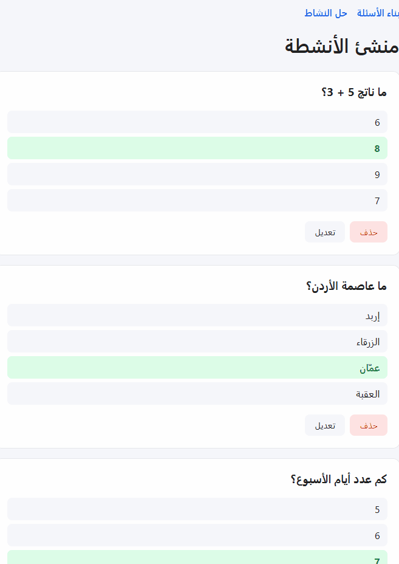

# Activity Builder | منشئ الأنشطة

An Arabic-first (RTL) web app for teachers to build multiple-choice activities and for students to solve them with instant feedback.

🔗 **Live demo:** https://activity-builder-chi.vercel.app/



## Features

- Create, edit, and delete multiple-choice questions in a modal form
- Input validation with inline error messages
- Questions persist across sessions using localStorage (with safe parsing)
- Student mode: one question at a time, instant correct/wrong feedback, final score
- Full RTL support for Arabic
- Client-side routing between builder and play modes

## Tech Stack

- React (Vite)
- React Router
- CSS with custom properties
- Deployed on Vercel

## What I Learned

- Lifting state up to share data between routes
- Resetting component state using the `key` prop instead of syncing with `useEffect`
- Handling stale state (e.g. deleting a question while it is being edited)
- Validating data from external sources like localStorage before using it
- Cleaning up event listeners in `useEffect`

## Run Locally

```bash
npm install
npm run dev
```

## Roadmap

- [ ] More question types (drag & drop, matching, ordering)
- [ ] User accounts and shareable activity links (Supabase)
- [ ] TypeScript migration